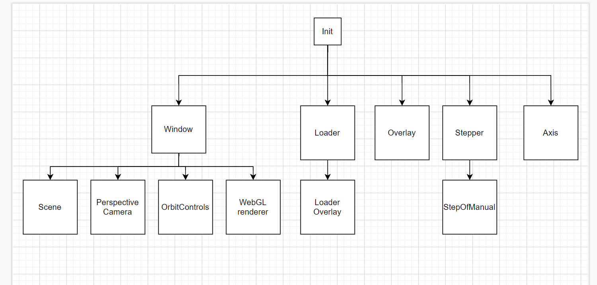

# Three JS Manual

This repo contains source code for this project.
GitHub Workflow automatically deploys latest push to GitHub pages.

- https://mattjoke.github.io/ThreeJS-library/

Trello with ToDo (view-only:

- https://trello.com/b/hXZva22f/threejs-library-to-do

## Basic usage

_This usage is subject to change_

    const data = {
        files: [
            {
                file: "models/files/Bar1.stl",
                color: "yellow",
                name: "1",
            },
            {
                file: "models/files/Bar2.stl",
                color: "orange",
                name: "2",
            },
            {
                file: "models/files/Bar3.stl",
                color: "#192833",
                name: "3",
            },
            {
                file: "models/files/Bar4.stl",
                name: "4",
            },
            {
                file: "models/files/Base_gr.stl",
                name: "5",
            }
        ],
        steps: [
            {
                name: "Init",
                positions: [
                    {
                        name: "1",
                        position: new Vector3(10, 10, 10),
                    },
                ],
            },
            {
                name: "First Step",
                positions: [
                    {
                        name: "1",
                        position: new Vector3(7, 7, 7),
                    },
                ],
            },
            {
                name: "Second Step",
                positions: [
                    {
                        name: "1",
                        position: new Vector3(5, 10, 10),
                    },
                ],
            },
        ],
    };

    const config = {
        container: document.getElementById("third"),
        color: "#123456",
    };

    const t2 = new Init(config);
    t2.withJSON(data);

## Classes

Main class the user will interact is currently _Init_ class, this will likely change with added Observer/Factory class.

### High level look at the classes

This image contains basic high-level look on the class scheme (updated 30.9.2021)

## Factory

This class is basic interface for developers.

### Properties

- _private_ instance - contains current instance of Init class

- _public_ objectsLoaded - changed to true after successful call of _loadJSON_ function

### Functions

- _public async_ loadJSON(json: JSON) - loads and places objects to scene

- _public_ selectItem(id: ObjectID) - returns instance of Object3D (contains loaded geometry, visible mesh and outline mesh)

- _public_ moveToStep(stepNumber: number) - moves Stepper instance to specified step and syncs it with Overlay

- _public_ on(selector: ObejctID, event: string, callback: Function) - adds callbacks to object specified with selector.

- _public_ group(event: string, callback: Function) - adds callback for ALL objects on specified event.

## Init

Handles Window, Overlay, Stepper and Object initialization

### Properties

- _private_ window: Window;
- _private_ overlay: HTMLDivElement;
- _private_ stepper: Stepper | undefined;
- _private_ objects: Objects3D;

### Functions

- _public_ initPlane()
- _private_ initAxes()
- _public_ async withJSON(json: JSON) - handles loading with JSON
- _private_ checkConfig(config: Config)
- _public_ getObjects()
- _public_ getStepper()
- _public_ setStep(stepNumber: number)

## Loader

Fuction, that loads models specified by input JSON.
Also loads Loader Overlay, which is only HTML Element (showed when models are loading).

Returns: Objects3D - Map containing loaded models

## Overlay

Function, that initializes Overlay/Menu of the window

Input parameters: instance of Stepper, instance of Window

Returns: HTMLDivElement, containing Initialized stepper

## Axis (currently broken)

Function, that initializes axes.

Returns: Computed axes.

## Stepper

Class that initializes steps and handles redrawing on positions specified in JSON.

### Properties

- _private_ objects: Objects3D;
- _private_ currentStep: StepOfManual;
- _private_ currentStepPosition: number;
- _public_ length: number;

### Functions

- _private_ redraw()
- _public_ setStep(position: number) - sets stepper for specific step
- _public_ moveStepUp()
- _public_ moveStepDown()
- _public_ getCurrentStep()

## StepOfManual

Sub-class of Stepper. Is used as building block for linked list of Steps.

### Properties

- prev: StepOfManual | null
- next: StepOfManual | null
- name: string;
- positions: Position[]

## Window

Initializes and handles actual drawing to div.

### Properties

- #### Window specific
  - _public_ scene: Scene;
  - _private_ renderer: WebGLRenderer;
  - _private_ camera: PerspectiveCamera;
  - _public_ container: HTMLElement;
- #### Control/selection specific
  - _private_ orbitalControls: OrbitControls;
  - _private_ mouse: Vector2;
  - _private_ raycaster: Raycaster;
- #### Animation specific
  - _private_ animators: any[]

### Functions

- _public_ resetCamera()
- _public_ getCamera()
- _public_ getDomRect()
- _private_ onWindowResize()
- _public_ addObject(...objects: Object3D[]) - adds object/s to scene
- _private_ selectObject(position: inputPosition, canvas: DOMRect) - shoots ray and calculates selection of item
- _private_ animate()

Other classes are used from ThreeJS library.
